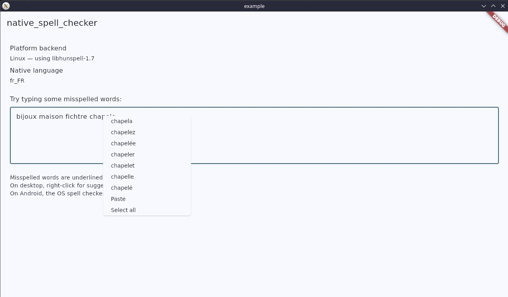

# native_spell_checker — Technical reference

> This is the full technical reference for GitHub. For the pub.dev-friendly version, see [README.md](README.md).
>
> Version française : [README_GH_FR.md](README_GH_FR.md)

A Flutter plugin that provides native OS spell checking on Windows, Linux, and Android — zero bundled dictionaries, uses the operating system's built-in spell checker.

- **pub.dev:** https://pub.dev/packages/native_spell_checker
- **Repository:** https://github.com/Sebastien-VZN/native_spell_checker

## The problem

Flutter's `SpellCheckService` abstraction lets you plug a custom spell checker into any `TextField` via `spellCheckConfiguration`. On Android, Flutter ships `DefaultSpellCheckService` (MethodChannel → Android `TextServicesManager`). On desktop (Windows, Linux), there is **nothing** — the framework falls back to "spell check disabled".

This plugin fills that gap by wrapping the native OS APIs:

- **Windows**: `Windows.Data.Text.SpellChecker` (WinRT COM) — the same engine that powers Windows Notepad, Edge, and Office. Exposed via the `win32` Dart package (FFI to COM interfaces, no native C++ to compile).
- **Linux**: `libhunspell-1.7` — the standard spell-checking library on Debian/Ubuntu. Dictionaries are `.aff`+`.dic` files installed via `apt install hunspell-fr`, `hunspell-en-us`, etc.
- **Android**: defers to Flutter's built-in `DefaultSpellCheckService` — no code needed.

Zero bundled dictionaries. The OS provides everything. 100% offline.

## Screenshots

| Windows | Linux | Android |
|---|---|---|
|  |  |  |

## Architecture — two API levels

The plugin offers two levels of API:

1. **Option A — drop-in widgets** (`SpellCheckTextField`, `SpellCheckTextFormField`): direct replacements for `TextField` / `TextFormField` with spell check, context menu suggestions, and right-click caret positioning pre-wired. The consumer just swaps their widget — everything else is automatic.
2. **Option B — manual building blocks** (`configuration()`, `contextMenuBuilder`, `onSecondaryTapDown`): the consumer keeps their native widget and wires the functions themselves via a `Listener`.

Both options coexist. The drop-in widgets (Option A) use the building blocks (Option B) internally via a shared mixin (`SpellCheckTextMixin`).

```
NativeSpellChecker (public static API)
  ├── configuration(misspelledTextStyle) → SpellCheckConfiguration
  ├── contextMenuBuilder(context, editableTextState) → Widget (menu with suggestions)
  ├── onSecondaryTapDown(textFieldKey, controller, event) → void (reposition caret on right-click)
  ├── defaultMisspelledTextStyle (const TextStyle — red wavy underline)
  └── resolvedLanguageTag({Locale? locale}) → Future<String?>

SpellCheckTextField / SpellCheckTextFormField (drop-in widgets)
  └── SpellCheckTextMixin (shared logic: right-click caret, spell config, Listener wrap)

NativeSpellCheckService (memoized singleton)
  ├── _delegate: NativeSpellCheckBackend (abstract)
  │     ├── WindowsSpellCheckService  (win32 COM, Isolate.run MTA)
  │     └── LinuxSpellCheckService     (dart:ffi, same-thread)
  ├── _lastText / _lastSpans          (cache of last spell check)
  └── findSuggestionSpanAt(text, offset) → SuggestionSpan? (sync)
```

## Design decisions

### Windows — COM apartment (MTA vs STA)

The Flutter Windows runner initializes the UI thread as STA (Single-Threaded Apartment). Calling `CoInitializeEx(COINIT_MULTITHREADED)` on this thread throws `RPC_E_CHANGED_MODE` (0x80010106). The exception is swallowed by the plugin, resulting in zero spell check results, zero crash — just silence.

**Solution**: all COM work runs inside `Isolate.run`. The worker isolate starts fresh with MTA, so COM init succeeds. WinRT `ISpellChecker2` objects are agile — they work in either apartment. All methods running in the isolate are `static` (the closure cannot capture `this` across isolate boundaries). `_ensureComInit` tolerates `S_FALSE` (already initialized, same apartment) and `RPC_E_CHANGED_MODE` (already initialized, different apartment).

### Windows — misspelledTextStyle default

`EditableText` in debug mode asserts `spellCheckConfiguration.misspelledTextStyle != null`. Without a default style, the app crashes in debug. `configuration()` provides a default red wavy underline (`TextStyle(decoration: underline, decorationColor: red, decorationStyle: wavy)`), matching Material's `materialMisspelledTextStyle`. Safe for non-Material consumers too.

### Windows — registerWith() signature

`dartPluginClass: NativeSpellChecker` in pubspec.yaml causes Flutter to generate `dart_plugin_registrant.dart` which calls `NativeSpellChecker.registerWith()` with zero arguments. If the signature requires a positional parameter, the build fails at MSBuild time. The contract test `native_spell_checker_plugin_contract_test.dart` reproduces this exact call so the error surfaces at `flutter test` / `dart analyze` — before the Windows build.

### Context menu with suggestions — synchronous builder, async backend

`contextMenuBuilder` is synchronous, but `fetchSpellCheckSuggestions` is async (it queries the OS). You can't `await` inside a context builder.

**Solution**: `NativeSpellCheckService` caches the last spell-check result (`_lastText` + `_lastSpans`) after each successful `fetchSpellCheckSuggestions` call. `findSuggestionSpanAt(text, offset)` does a synchronous lookup in the cache. If `text != _lastText`, the cache is stale → returns `null` (no suggestions; the spell check will re-run after the next keystroke). `NativeSpellChecker.contextMenuBuilder` inserts a `ContextMenuButtonItem` per suggestion above the standard Cut/Copy/Paste/Select All buttons. Clicking a suggestion replaces the misspelled word via `userUpdateTextEditingValue`.

On Android, `service` is `null` → the standard menu is used (the OS handles its own suggestions via `DefaultSpellCheckService`).

### Right-click without prior left-click — onSecondaryTapDown

`findSuggestionSpanAt` uses `value.selection.baseOffset` (the text caret position). On desktop, Flutter does **not** reposition the caret on right-click. The internal `TextSelectionGestureDetector` stores the tap position to anchor the context menu visually, but does not move the text selection. So if the caret is at the end of the text and the user right-clicks a misspelled word at the beginning, `baseOffset` is elsewhere → no suggestions in the menu.

**Solution**: `NativeSpellChecker.onSecondaryTapDown(textFieldKey, controller, event)` — a static helper the consumer calls from a `Listener(onPointerDown:)`. The helper:

1. Finds the `RenderEditable` in the subtree via recursive child traversal.
2. Calls `renderEditable.getPositionForPoint(event.position)` → `TextPosition` under the click.
3. Moves the controller's caret **before** the context menu opens.
4. `contextMenuBuilder` then reads the correct `baseOffset` → suggestions appear for the right-clicked word.

Critical Flutter APIs (naming pitfalls):
- `RenderEditable.getPositionForPoint(Offset globalPosition)` — NOT `getPositionForOffset` (that's `TextPainter`).
- `kSecondaryButton` is in `package:flutter/gestures.dart`, re-exported by `material.dart`.
- `RenderEditable` imports from `package:flutter/rendering.dart`.

### Why the wrapper widget exists

`SpellCheckTextField` / `SpellCheckTextFormField` wrap the native `TextField` / `TextFormField` in a `Listener` that intercepts right-click and repositions the caret before the context menu opens. Without this `Listener`, suggestions are looked up at the current caret position, not at the word the user actually right-clicked.

On Android, the wrapper is a no-op — the OS handles everything natively.

## Usage

### Option A — drop-in widget (recommended)

```dart
import 'package:native_spell_checker/native_spell_checker.dart';

SpellCheckTextField(
  controller: myController,
  maxLines: 5,
  decoration: const InputDecoration(hintText: 'Type here...'),
)
```

For forms with validation:

```dart
SpellCheckTextFormField(
  controller: myController,
  validator: (value) => value!.isEmpty ? 'Required' : null,
  maxLines: 5,
  decoration: const InputDecoration(hintText: 'Type here...'),
  misspelledTextStyle: myCustomStyle,
  misspelledSelectionColor: Colors.red,
)
```

### Option B — manual wiring

```dart
import 'package:flutter/gestures.dart' show kSecondaryButton;
import 'package:native_spell_checker/native_spell_checker.dart';

final GlobalKey _key = GlobalKey();

Listener(
  onPointerDown: (event) {
    if (event.buttons == kSecondaryButton) {
      NativeSpellChecker.onSecondaryTapDown(_key, controller, event);
    }
  },
  child: TextField(
    key: _key,
    controller: controller,
    spellCheckConfiguration: NativeSpellChecker.configuration(),
    contextMenuBuilder: NativeSpellChecker.contextMenuBuilder,
  ),
)
```

Available building blocks:

- `NativeSpellChecker.configuration(misspelledTextStyle)` — returns a `SpellCheckConfiguration` wired to the OS spell checker.
- `NativeSpellChecker.contextMenuBuilder` — builds a context menu with spelling suggestions above the standard Cut/Copy/Paste/Select All buttons.
- `NativeSpellChecker.onSecondaryTapDown(key, controller, event)` — repositions the caret to the right-click location.

### Discover the language the spell checker will use

```dart
// null locale → resolve from the OS default locale.
final tag = await NativeSpellChecker.resolvedLanguageTag();
// e.g. "fr-FR" (Windows BCP-47) / "fr_FR" (Linux Hunspell) / null (Android)

// explicit locale → same fallback chain used during spell checking.
final enTag = await NativeSpellChecker.resolvedLanguageTag(locale: const Locale('en', 'US'));
```

Returns `null` on Android (where the plugin defers to Flutter). Use `Platform.localeName` to read the system locale on Android.

## How it works

| Platform | Backend | Dictionary source | Language tag format |
|---|---|---|---|
| Android | Flutter `DefaultSpellCheckService` | OS (TextServicesManager) | `null` (use `Platform.localeName`) |
| Windows | WinRT `ISpellChecker2` (COM FFI) | OS (Windows SpellChecker) | BCP-47 (`fr-FR`, `en-US`) |
| Linux | `libhunspell-1.7` (dart:ffi) | `/usr/share/hunspell/` | Hunspell (`fr_FR`, `en_US`) |

### Linux prerequisite

The `libhunspell-1.7-0` package must be installed on the target system. On Debian/Ubuntu:

```bash
sudo apt-get install libhunspell-1.7-0 hunspell-fr hunspell-en-us
```

Dictionaries are provided by `hunspell-*` packages and stored in `/usr/share/hunspell/`.

## Tests

Three test files, each with a distinct purpose:

| File | Scope | Platform | Runs in CI |
|---|---|---|---|
| `native_spell_check_test.dart` | Unit + live (cross-platform) | All | Yes (ubuntu) |
| `windows_spell_check_test.dart` | Live (Windows COM) | Windows only | No (CI is ubuntu) |
| `native_spell_checker_plugin_contract_test.dart` | Static contract | All | Yes |

The contract test is a safety net: it reproduces the exact zero-argument `registerWith()` call that Flutter's generated `dart_plugin_registrant.dart` makes. If the signature regresses, the test file fails to compile — the error surfaces at `flutter test` / `dart analyze` before the Windows build.

```bash
flutter test                              # unit + contract + live (cross-platform)
flutter test test/windows_spell_check_test.dart  # Windows live tests (Windows host only)
```

For the full testing documentation, see [doc/testing.md](doc/testing.md).

## Platforms

| Platform | Status |
|---|---|
| Android | Manually validated |
| Linux | Manually validated |
| Windows | Manually validated |
| iOS | Not supported |
| macOS | Not supported |

No iOS or macOS — the plugin targets platforms where Flutter lacks a built-in spell check service. iOS and macOS already have system spell check wired through the platform's text input system.

## Maintenance & contribution

I'm not a full-time maintainer. I built this plugin for my own project ([Axomind](https://github.com/Sebastien-VZN)), where it provides spell checking for a mindmap and messaging desktop app, and I publish it in case it's useful to others.

What that means in practice:

- **Bug reports** — welcome. Open a [GitHub Issue](https://github.com/Sebastien-VZN/native_spell_checker/issues) with a repro and I'll look into it. Bugs that break spell checking on a supported platform or regress the context menu suggestions are the priority.
- **Feature requests** — I'll consider them only when they're relevant to my own use case: desktop text editors, messaging, and content authoring. If a requested feature fits that scope, I'm happy to discuss it.
- **Out-of-scope features** — if you need behavior aimed at a different kind of app or platform (iOS/macOS support, cloud-based suggestions, custom dictionaries), the cleanest path is to fork the project. The codebase is small and the platform backends are cleanly separated, so adapting it should be straightforward.

This is a focused plugin I use in production, shared publicly. Clear expectations on both sides keep it sustainable.

## Origin & license

Original plugin (not a fork). MIT license — see [LICENSE](LICENSE).