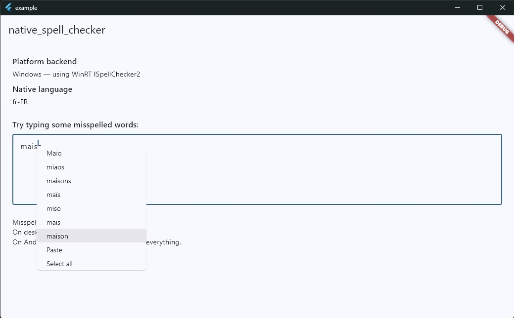
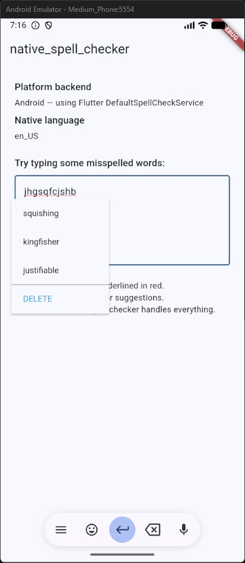

# native_spell_checker — Référence technique

> Ceci est la référence technique complète pour GitHub. Pour la version adaptée à pub.dev, voir [README_FR.md](README_FR.md).
>
> English version: [README_GH.md](README_GH.md)

Un plugin Flutter qui fournit la correction orthographique native de l'OS sur Windows, Linux et Android — zéro dictionnaire bundlé, utilise le correcteur orthographique intégré du système d'exploitation.

- **pub.dev :** https://pub.dev/packages/native_spell_checker
- **Dépôt :** https://github.com/Sebastien-VZN/native_spell_checker

## Le problème

L'abstraction `SpellCheckService` de Flutter permet de brancher un correcteur orthographique personnalisé dans n'importe quel `TextField` via `spellCheckConfiguration`. Sur Android, Flutter fournit `DefaultSpellCheckService` (MethodChannel → Android `TextServicesManager`). Sur desktop (Windows, Linux), il n'y a **rien** — le framework se rabat sur « correction orthographique désactivée ».

Ce plugin comble ce manque en encapsulant les APIs natives de l'OS :

- **Windows** : `Windows.Data.Text.SpellChecker` (WinRT COM) — le même moteur que le Bloc-notes Windows, Edge et Office. Exposé via le package Dart `win32` (FFI vers les interfaces COM, aucun C++ natif à compiler).
- **Linux** : `libhunspell-1.7` — la bibliothèque standard de correction orthographique sur Debian/Ubuntu. Les dictionnaires sont des fichiers `.aff`+`.dic` installés via `apt install hunspell-fr`, `hunspell-en-us`, etc.
- **Android** : délègue au `DefaultSpellCheckService` intégré de Flutter — aucun code nécessaire.

Zéro dictionnaire bundlé. L'OS fournit tout. 100% hors ligne.

## Captures d'écran

| Windows | Android |
|---|---|
|  |  |

## Architecture — deux niveaux d'API

Le plugin offre deux niveaux d'API :

1. **Option A — widgets drop-in** (`SpellCheckTextField`, `SpellCheckTextFormField`) : remplaçants directs de `TextField` / `TextFormField` avec correction orthographique, suggestions dans le menu contextuel et repositionnement du curseur au clic droit pré-câblés. Le consommateur remplace juste son widget — tout le reste est automatique.
2. **Option B — briques manuelles** (`configuration()`, `contextMenuBuilder`, `onSecondaryTapDown`) : le consommateur garde son widget natif et raccorde les fonctions lui-même via un `Listener`.

Les deux options coexistent. Les widgets drop-in (Option A) utilisent les briques (Option B) en interne via un mixin partagé (`SpellCheckTextMixin`).

```
NativeSpellChecker (API publique statique)
  ├── configuration(misspelledTextStyle) → SpellCheckConfiguration
  ├── contextMenuBuilder(context, editableTextState) → Widget (menu avec suggestions)
  ├── onSecondaryTapDown(textFieldKey, controller, event) → void (repositionne le curseur au clic droit)
  ├── defaultMisspelledTextStyle (const TextStyle — soulignement rouge ondulé)
  └── resolvedLanguageTag({Locale? locale}) → Future<String?>

SpellCheckTextField / SpellCheckTextFormField (widgets drop-in)
  └── SpellCheckTextMixin (logique partagée : curseur clic droit, config spell, Listener)

NativeSpellCheckService (singleton mémoisé)
  ├── _delegate: NativeSpellCheckBackend (abstract)
  │     ├── WindowsSpellCheckService  (win32 COM, Isolate.run MTA)
  │     └── LinuxSpellCheckService     (dart:ffi, même thread)
  ├── _lastText / _lastSpans          (cache du dernier spell check)
  └── findSuggestionSpanAt(text, offset) → SuggestionSpan? (sync)
```

## Décisions de design

### Windows — appartement COM (MTA vs STA)

Le runner Windows de Flutter initialise le thread UI en STA (Single-Threaded Apartment). Appeler `CoInitializeEx(COINIT_MULTITHREADED)` sur ce thread lève `RPC_E_CHANGED_MODE` (0x80010106). L'exception est avalée par le plugin, ce qui donne zéro résultat de correction, zéro crash — juste du silence.

**Solution** : tout le travail COM s'exécute dans `Isolate.run`. L'isolate worker démarre frais en MTA, donc l'init COM réussit. Les objets WinRT `ISpellChecker2` sont agile — ils fonctionnent dans les deux appartements. Toutes les méthodes s'exécutant dans l'isolate sont `static` (la closure ne peut pas capturer `this` au-delà des frontières d'isolate). `_ensureComInit` tolère `S_FALSE` (déjà initialisé, même appartement) et `RPC_E_CHANGED_MODE` (déjà initialisé, appartement différent).

### Windows — misspelledTextStyle par défaut

`EditableText` en mode debug asserte `spellCheckConfiguration.misspelledTextStyle != null`. Sans style par défaut, l'app crash en debug. `configuration()` fournit un soulignement rouge ondulé par défaut (`TextStyle(decoration: underline, decorationColor: red, decorationStyle: wavy)`), correspondant au `materialMisspelledTextStyle` de Material. Sûr aussi pour les consommateurs non-Material.

### Windows — signature registerWith()

`dartPluginClass: NativeSpellChecker` dans pubspec.yaml fait que Flutter génère `dart_plugin_registrant.dart` qui appelle `NativeSpellChecker.registerWith()` sans argument. Si la signature exige un paramètre positionnel, le build échoue au moment de MSBuild. Le test de contrat `native_spell_checker_plugin_contract_test.dart` reproduit cet appel exact pour que l'erreur apparaisse à `flutter test` / `dart analyze` — avant le build Windows.

### Menu contextuel avec suggestions — builder synchrone, backend async

`contextMenuBuilder` est synchrone, mais `fetchSpellCheckSuggestions` est async (elle interroge l'OS). Impossible de `await` dans un context builder.

**Solution** : `NativeSpellCheckService` met en cache le dernier résultat de correction (`_lastText` + `_lastSpans`) après chaque appel réussi à `fetchSpellCheckSuggestions`. `findSuggestionSpanAt(text, offset)` fait un lookup synchrone dans le cache. Si `text != _lastText`, le cache est périmé → retourne `null` (pas de suggestions ; la correction relancera après la prochaine frappe). `NativeSpellChecker.contextMenuBuilder` insère un `ContextMenuButtonItem` par suggestion au-dessus des boutons standard Cut/Copy/Paste/Select All. Cliquer une suggestion remplace le mot fautif via `userUpdateTextEditingValue`.

Sur Android, `service` est `null` → le menu standard est utilisé (l'OS gère ses propres suggestions via `DefaultSpellCheckService`).

### Clic droit sans clic gauche préalable — onSecondaryTapDown

`findSuggestionSpanAt` utilise `value.selection.baseOffset` (la position du curseur texte). Sur desktop, Flutter ne repositionne **pas** le curseur au clic droit. Le `TextSelectionGestureDetector` interne stocke la position du tap pour ancrer visuellement le menu contextuel, mais ne déplace pas la sélection de texte. Donc si le curseur est à la fin du texte et l'utilisateur fait un clic droit sur un mot fautif au début, `baseOffset` est ailleurs → pas de suggestions dans le menu.

**Solution** : `NativeSpellChecker.onSecondaryTapDown(textFieldKey, controller, event)` — un helper statique que le consommateur appelle depuis un `Listener(onPointerDown:)`. Le helper :

1. Trouve le `RenderEditable` dans le subtree via parcours récursif des children.
2. Appelle `renderEditable.getPositionForPoint(event.position)` → `TextPosition` sous le clic.
3. Déplace le curseur du controller **avant** que le menu contextuel s'ouvre.
4. `contextMenuBuilder` lit alors le bon `baseOffset` → les suggestions apparaissent pour le mot cliqué.

APIs Flutter critiques (pièges de nommage) :
- `RenderEditable.getPositionForPoint(Offset globalPosition)` — PAS `getPositionForOffset` (ça c'est `TextPainter`).
- `kSecondaryButton` est dans `package:flutter/gestures.dart`, ré-exporté par `material.dart`.
- `RenderEditable` s'importe depuis `package:flutter/rendering.dart`.

### Pourquoi le widget wrapper existe

`SpellCheckTextField` / `SpellCheckTextFormField` encapsulent le `TextField` / `TextFormField` natif dans un `Listener` qui intercepte le clic droit et repositionne le curseur avant l'ouverture du menu contextuel. Sans ce `Listener`, les suggestions sont recherchées à la position actuelle du curseur, pas sur le mot que l'utilisateur a réellement cliqué.

Sur Android, le wrapper est un no-op — l'OS gère tout nativement.

## Utilisation

### Option A — widget drop-in (recommandé)

```dart
import 'package:native_spell_checker/native_spell_checker.dart';

SpellCheckTextField(
  controller: myController,
  maxLines: 5,
  decoration: const InputDecoration(hintText: 'Type here...'),
)
```

Pour les formulaires avec validation :

```dart
SpellCheckTextFormField(
  controller: myController,
  validator: (value) => value!.isEmpty ? 'Required' : null,
  maxLines: 5,
  decoration: const InputDecoration(hintText: 'Type here...'),
  misspelledTextStyle: myCustomStyle,
  misspelledSelectionColor: Colors.red,
)
```

### Option B — câblage manuel

```dart
import 'package:flutter/gestures.dart' show kSecondaryButton;
import 'package:native_spell_checker/native_spell_checker.dart';

final GlobalKey _key = GlobalKey();

Listener(
  onPointerDown: (event) {
    if (event.buttons == kSecondaryButton) {
      NativeSpellChecker.onSecondaryTapDown(_key, controller, event);
    }
  },
  child: TextField(
    key: _key,
    controller: controller,
    spellCheckConfiguration: NativeSpellChecker.configuration(),
    contextMenuBuilder: NativeSpellChecker.contextMenuBuilder,
  ),
)
```

Briques disponibles :

- `NativeSpellChecker.configuration(misspelledTextStyle)` — retourne une `SpellCheckConfiguration` branchée sur le correcteur de l'OS.
- `NativeSpellChecker.contextMenuBuilder` — construit un menu contextuel avec les suggestions orthographiques au-dessus des boutons standard Cut/Copy/Paste/Select All.
- `NativeSpellChecker.onSecondaryTapDown(key, controller, event)` — repositionne le curseur à l'emplacement du clic droit.

### Découvrir la langue que le correcteur utilisera

```dart
// locale null → résoudre depuis la locale par défaut de l'OS.
final tag = await NativeSpellChecker.resolvedLanguageTag();
// ex. "fr-FR" (Windows BCP-47) / "fr_FR" (Linux Hunspell) / null (Android)

// locale explicite → même chaîne de fallback que pendant la correction.
final enTag = await NativeSpellChecker.resolvedLanguageTag(locale: const Locale('en', 'US'));
```

Retourne `null` sur Android (où le plugin délègue à Flutter). Utilisez `Platform.localeName` pour lire la locale système sur Android.

## Fonctionnement

| Plateforme | Backend | Source des dictionnaires | Format du tag de langue |
|---|---|---|---|
| Android | Flutter `DefaultSpellCheckService` | OS (TextServicesManager) | `null` (utiliser `Platform.localeName`) |
| Windows | WinRT `ISpellChecker2` (COM FFI) | OS (Windows SpellChecker) | BCP-47 (`fr-FR`, `en-US`) |
| Linux | `libhunspell-1.7` (dart:ffi) | `/usr/share/hunspell/` | Hunspell (`fr_FR`, `en_US`) |

### Prérequis Linux

Le paquet `libhunspell-1.7-0` doit être installé sur le système cible. Sur Debian/Ubuntu :

```bash
sudo apt-get install libhunspell-1.7-0 hunspell-fr hunspell-en-us
```

Les dictionnaires sont fournis par les paquets `hunspell-*` et stockés dans `/usr/share/hunspell/`.

## Tests

Trois fichiers de tests, chacun avec un but distinct :

| Fichier | Scope | Plateforme | Tourne en CI |
|---|---|---|---|
| `native_spell_check_test.dart` | Unit + live (cross-platform) | Toutes | Oui (ubuntu) |
| `windows_spell_check_test.dart` | Live (Windows COM) | Windows uniquement | Non (CI = ubuntu) |
| `native_spell_checker_plugin_contract_test.dart` | Contrat statique | Toutes | Oui |

Le test de contrat est un filet de sécurité : il reproduit l'appel exact à zéro argument `registerWith()` que le `dart_plugin_registrant.dart` généré par Flutter effectue. Si la signature régresse, le fichier de test ne compile pas — l'erreur apparaît à `flutter test` / `dart analyze` avant le build Windows.

```bash
flutter test                              # unit + contrat + live (cross-platform)
flutter test test/windows_spell_check_test.dart  # tests live Windows (hôte Windows uniquement)
```

Pour la documentation complète des tests, voir [doc/testing.md](doc/testing.md).

## Plateformes

| Plateforme | Statut |
|---|---|
| Android | Validé manuellement |
| Linux | Validé manuellement |
| Windows | Validé manuellement |
| iOS | Non supporté |
| macOS | Non supporté |

Pas d'iOS ni macOS — le plugin cible les plateformes où Flutter manque d'un service de correction orthographique intégré. iOS et macOS ont déjà la correction système branchée via le système de saisie texte de la plateforme.

## Maintenance & contribution

Je ne suis pas un mainteneur à temps plein. J'ai construit ce plugin pour mon propre projet ([Axomind](https://github.com/Sebastien-VZN)), où il fournit la correction orthographique pour une app desktop de carte mentale et de messagerie, et je le publie au cas où ça serait utile à d'autres.

Ce que ça signifie en pratique :

- **Rapports de bugs** — bienvenus. Ouvrez une [GitHub Issue](https://github.com/Sebastien-VZN/native_spell_checker/issues) avec un repro et je regarderai. Les bugs qui cassent la correction sur une plateforme supportée ou régressent les suggestions du menu contextuel sont la priorité.
- **Demandes de fonctionnalités** — je les considérerai seulement quand elles sont pertinentes pour mon propre cas d'usage : éditeurs de texte desktop, messagerie et création de contenu. Si une fonctionnalité demandée correspond à ce périmètre, je suis heureux d'en discuter.
- **Fonctionnalités hors périmètre** — si vous avez besoin d'un comportement visant un autre type d'app ou plateforme (support iOS/macOS, suggestions cloud, dictionnaires personnalisés), le chemin le plus propre est de forker le projet. La codebase est petite et les backends par plateforme sont proprement séparés, donc l'adapter devrait être direct.

C'est un plugin ciblé que j'utilise en production, partagé publiquement. Des attentes claires des deux côtés gardent ça durable.

## Origine & licence

Plugin original (pas un fork). Licence MIT — voir [LICENSE](LICENSE).